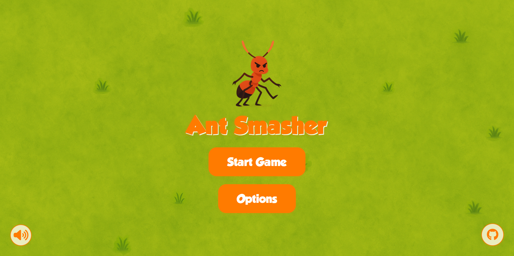

# 🐜 Ant Smasher Game

A modern, responsive, and engaging Ant Smasher game built with vanilla HTML, CSS, and JavaScript. Experience the thrill of smashing ants before they take over your screen! Features smooth animations, sound effects, and a polished user interface that works seamlessly on both desktop and mobile devices.



## 🎮 Live Demo

**[Play Ant Smasher Now!](https://curtainteddy.github.io/LSPP-Ant-Smasher/)**

---

## ✨ Features

### 🎯 Core Gameplay
- **Dynamic Ant Spawning**: Ants spawn randomly across the screen with increasing frequency
- **Realistic Movement**: Ants move in random directions with natural bouncing off screen edges
- **Click-to-Smash Mechanics**: Intuitive click/tap controls for smashing ants
- **Score System**: Real-time score tracking with persistent high score storage
- **Progressive Difficulty**: Spawn rate increases over time for escalating challenge

### 🎨 Visual & Audio Experience
- **Sprite Animation**: Smooth 3-frame walking animation using JavaScript-based frame cycling

- **Squash Animation**: Visual feedback when ants are smashed with scale effect
- **Sound Effects**: Multiple smash sounds with rotation system for variety
- **Background Music**: Immersive background music with volume control

### 🎛️ User Interface
- **Responsive Design**: Optimized for desktop, tablet, and mobile devices
- **Modern UI**: Clean, cartoon-style interface with playful typography
- **Game States**: Seamless transitions between menu, gameplay, pause, and game over screens
- **HUD Display**: Real-time score, high score, and ant count information
- **Settings Panel**: Customizable audio volumes and ant speed settings

### 🔧 Technical Features
- **Local Storage**: Persistent high scores and user preferences
- **Pause/Resume**: Full game state preservation during pause
- **Sound Management**: Comprehensive audio controls with mute/unmute functionality

---

## 🏗️ Implementation Details

### 🎮 Game Architecture
- **Object-Oriented Design**: Clean separation of concerns with dedicated `Ant` class
- **State Management**: Centralized game state handling (menu, playing, paused, gameover)
- **Event-Driven**: Responsive event handling for user interactions
- **Timer-Based Animation**: Precise frame timing for smooth sprite animations

### 💾 Data Persistence
- **Local Storage API**: Browser-based data storage for scores and settings
- **Settings Management**: Comprehensive options panel with persistent preferences
- **High Score Tracking**: Automatic saving and loading of best scores

---

## 📁 Project Structure

```
LSPP-Ant-Smasher/
├── 📄 index.html                 # Main HTML file with game structure
├── 📁 css/
│   └── 📄 style.css              # Complete styling and animations
├── 📁 js/
│   ├── 📄 main.js                # Core game logic and state management
│   └── 📄 ant.js                 # Ant class and behavior implementation
├── 📁 assets/
│   ├── 🖼️ bg.webp                # Background image (optimized)
│   ├── 🖼️ logo.webp              # Game logo
│   ├── 🖼️ ant_walk_1.webp        # Ant walking sprite frame 1
│   ├── 🖼️ ant_walk_2.webp        # Ant walking sprite frame 2
│   ├── 🖼️ ant_walk_3.webp        # Ant walking sprite frame 3
│   ├── 🖼️ ant_smashed.webp       # Smashed ant sprite
│   ├── 🎵 bg_music.mp3           # Background music
│   ├── 🎵 gameover.mp3           # Game over sound effect
│   ├── 🎵 smash_1.mp3            # Smash sound effect 1
│   ├── 🎵 smash_2.mp3            # Smash sound effect 2
│   ├── 🎵 smash_3.mp3            # Smash sound effect 3
│   ├── 🎵 smash_4.mp3            # Smash sound effect 4
│   ├── 🎵 smash_5.mp3            # Smash sound effect 5
│   ├── 🔤 grobold.ttf            # Custom font file
│   └── 🖼️ README.png             # Project banner image
└── 📄 README.md                  # Project documentation
```

---

## 🚀 Getting Started

### Prerequisites
- Modern web browser (Chrome, Firefox, Safari, Edge)
- No additional dependencies or installations required

### Installation & Setup
1. **Clone the repository**:
   ```bash
   git clone https://github.com/curtainteddy/LSPP-Ant-Smasher.git
   cd LSPP-Ant-Smasher
   ```

2. **Open the game**:
   - Double-click `index.html` to open in your browser
   - Or serve locally using any web server

3. **Start playing**:
   - Click "Start Game" to begin
   - Smash ants by clicking on them
   - Try to beat your high score!

---

## 📄 License

This project is licensed under the MIT License - see the [LICENSE](LICENSE) file for details.


## 🔗 Links

- **[Live Demo](https://curtainteddy.github.io/LSPP-Ant-Smasher/)**
- **[Issues & Feedback](https://github.com/curtainteddy/LSPP-Ant-Smasher/issues)**

---

**Enjoy smashing ants! 🐜💥**

